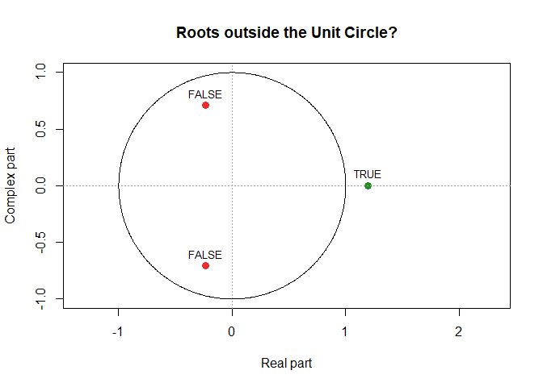

<!-- README.md is generated from README.Rmd. Please edit that file -->
The UnitCircle Package
======================

As of now this package only containts the `uc.check` function wich checks whether the roots of a given polynomial lie outside the Unit circle.

Usage
=====

The function `uc.check` has the following Arguments:

<table style="width:100%;">
<colgroup>
<col width="16%" />
<col width="83%" />
</colgroup>
<thead>
<tr class="header">
<th>Argument</th>
<th>Description</th>
</tr>
</thead>
<tbody>
<tr class="odd">
<td>pol_</td>
<td>A vector of polynomial coefficients in increasing order.</td>
</tr>
<tr class="even">
<td>plot_output</td>
<td>Logical that defines whether a graphical output should be created.</td>
</tr>
<tr class="odd">
<td>print_output</td>
<td>Logical that defines whether to print the results.</td>
</tr>
</tbody>
</table>

Examples:
=========

``` r
library(UnitCircle)
uc.check(pol_ = c(1,0,0.99999), plot_output = FALSE)
#>   real   complex outside
#> 1    0  1.000005    TRUE
#> 2    0 -1.000005    TRUE
#> *Results are rounded to 6 digits.
```

``` r
uc.check(pol_ = c(2,0,2.2,-3), plot_output = TRUE)
#>        real   complex outside
#> 1 -0.232289  0.708919   FALSE
#> 2 -0.232289 -0.708919   FALSE
#> 3  1.197912  0.000000    TRUE
#> *Results are rounded to 6 digits.
```



Installation
------------

### Install from CRAN

I'm sorry but installing UnitCircle from CRAN isn't possible atm.

### Install the latest development version

You can install the latest development version from github with

``` r
# install.packages("devtools")
devtools::install_github("BerriJ/UnitCircle")
```

License
-------

-   **UnitCircle** is licensed under [GPL-3](LICENSE)
